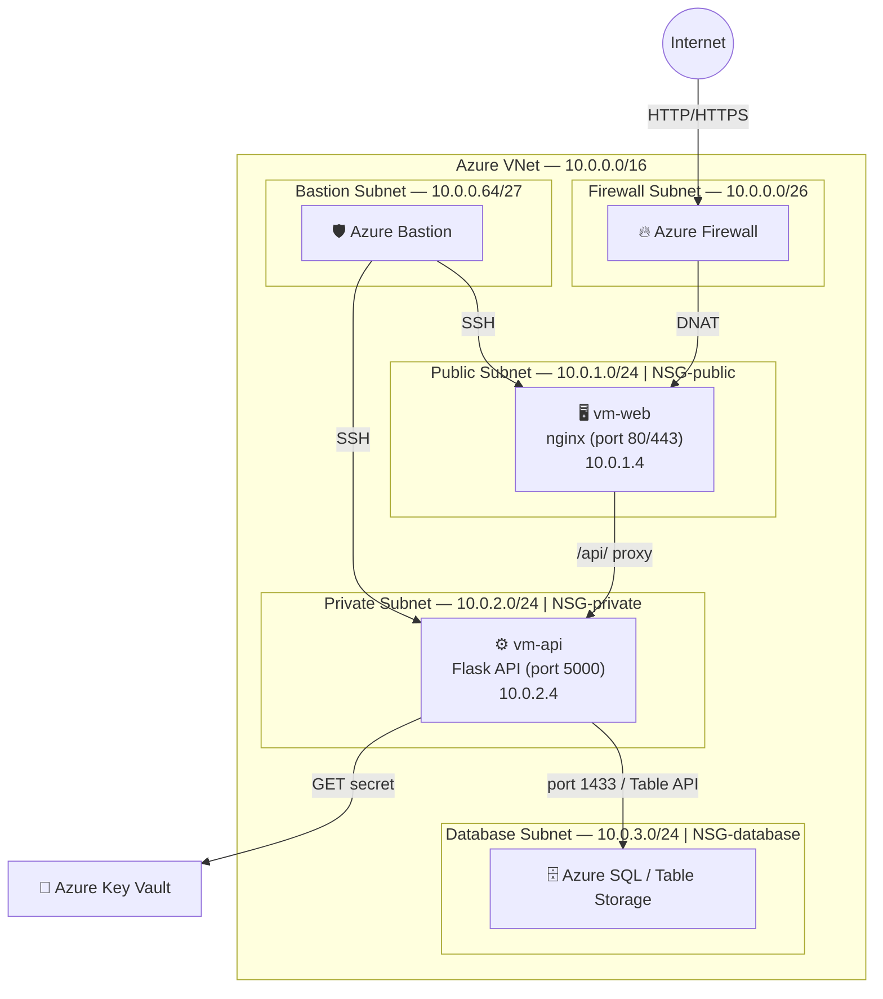

# EPI Bank — Azure Infrastructure

Terraform-project dat de cloud-infrastructuur voor de EPI Bank demo-omgeving uitrolt op Azure. Het simuleert een gelaagde bankarchitectuur met een publieke frontend, een private API-laag en een afgeschermde database.

---

## Architectuur



---

## Modules

| Module | Beschrijving |
|---|---|
| `vnet` | Virtual Network + 5 subnetten |
| `nsg` | Network Security Groups per subnet |
| `firewall` | Azure Firewall met DNAT-regel voor inkomend verkeer |
| `bastion` | Azure Bastion voor veilige SSH-toegang zonder publiek IP |
| `vms` | Web VM (nginx) en API VM (Flask) |
| `database` | Azure SQL / Table Storage |
| `keyvault` | Key Vault voor SSH-sleutels en connection strings |
| `policy` | Azure Policy voor compliance |

---

## Netwerk

| Subnet | CIDR | Doel |
|---|---|---|
| AzureFirewallSubnet | 10.0.0.0/26 | Azure Firewall (verplichte naam) |
| AzureBastionSubnet | 10.0.0.64/27 | Azure Bastion (verplichte naam) |
| public-subnet | 10.0.1.0/24 | Web VM (frontend) |
| private-subnet | 10.0.2.0/24 | API VM (backend) |
| database-subnet | 10.0.3.0/24 | Database |

---

## Variabelen

| Variabele | Default | Beschrijving |
|---|---|---|
| `location` | `westeurope` | Azure regio |
| `resource_group_name` | `epi` | Naam van de resource group |
| `bastion_subnet_prefix` | `10.0.0.64/27` | CIDR van het Bastion-subnet (gebruikt in NSG-regels) |
| `web_vm_private_ip` | `10.0.1.4` | Privé-IP van de web VM (gebruikt in Firewall DNAT) |

---

## Deployen

```bash
# Initialiseren
terraform init

# Controleer wat er aangemaakt wordt
terraform plan

# Uitrollen
terraform apply
```
